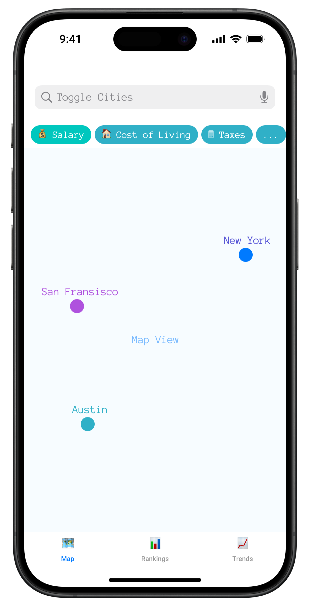
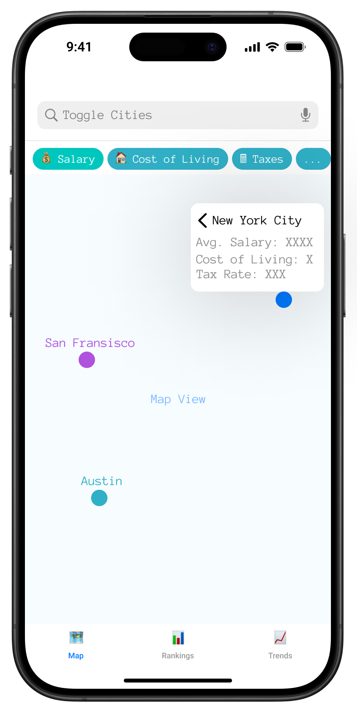
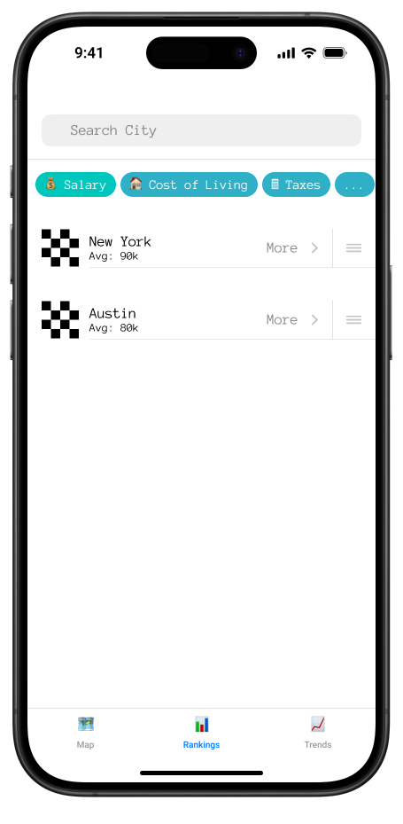

# Software Job Market Insights iOS App
## Final Project Proposal
## Penn State CMPSC 475 Applications Programming Fall 2024

### Problem Statement
Software professionals often struggle to make informed decisions about job locations due to the complexity of factors affecting total compensation, cost of living, and career advancement opportunities. While raw data which characterize each of these topics individually exist, it is difficult to visualize their interconnectedness.

### Solution Overview
UNFINISHED
The Software Job Market Insights iOS app will provide interactive visualizations in order to help software professionals analyze and compare job markets across the United States. The app will combine 

### Key Features

#### 1. Interactive Job Market Map
There are 4 options for displaying markers on a US map.

A) Software Developer Income + Expenses by City
    - Markers would be colored based on the average total compensation for software jobs in that city
    - There would also be an option to include cost of living in that ranking

B) Quantity of Software Jobs by City
    - Markers would be colored based on the total number of software jobs in that city
    
C) Company Job Location
    - Markers would be based on the average compensation of a software job offered by a company in that city
    - Includes a search bar in order to select company (Apple, Google, etc.)
        
D) Weighted Sum of the previous 3 measurements.
    - Weighted sum of the 3 above rankings
    - The ideal city would include a good balance of total number of software jobs, compensation of jobs, and which companies employ in that city

<div align="center">
<table>
<tr>
<td width="50%">
  
  <p align="center"><i>Interactive Job Market Map Sample</i></p>
</td>
<td width="50%">
  
  <p align="center"><i>Sample Annotation Displayed on Tap</i></p>
</td>
</tr>
</table>
</div>

#### 2. City Rankings & Comparisons
- Sortable list view of all tracked cities
- Ranking metrics:
  - Total compensation
  - Cost-adjusted compensation
  - Job availability
  - Growth potential
  - Quality of life score
- Side-by-side city comparison tool
- Detailed breakdown of each metric's components
- Export comparison data as PDF

<div align="center">
<table>
<tr>
<td width="50%">
  
  <p align="center"><i>Interactive Job Market Map Sample</i></p>
</td>
<td width="50%">
  
  <p align="center"><i>Sample Annotation Displayed on Tap</i></p>
</td>
</tr>
</table>
</div>

#### 3. Market Trends Dashboard
- Historical and projected industry trends
- Key metrics:
  - CS degree graduation rates
  - Industry hiring projections
  - Major employer hiring volumes
  - Inflation impact on compensation
  - Remote work trends
- Interactive charts and graphs
- Quarterly data updates

### Technical Implementation

#### Data Sources
- Company Hiring Data, Locations of Positions, Mean Salaries of Positions
  - https://www.kaggle.com/code/nileshthonte/levels-fyi-salary-dataset-eda-and-modelling/input
- Software Developer Income & Expenses per City
  - https://www.kaggle.com/datasets/thedevastator/u-s-software-developer-salaries/data
- Quantity of Software Developer Jobs by City
  - https://data.bls.gov/oes/#/occGeo/One%20occupation%20for%20multiple%20geographical%20areas

#### Frameworks

### Navigation

```
Tabs
    │
    ├── Map View (Main Tab)
    │   ├── Filter Controls
    │   └── City Detail View
    │
    ├── Rankings (Second Tab)
    │   ├── Sorting Controls
    │   └── City Comparison View
    │
    └── Trends (Third Tab)
        ├── Trend Selection
        └── Detailed Analysis View
```

### Development Timeline

